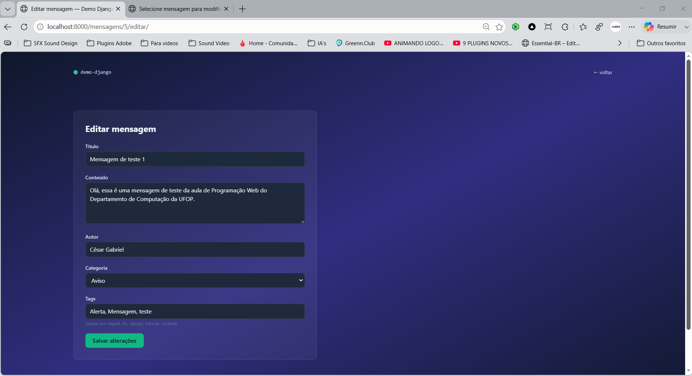
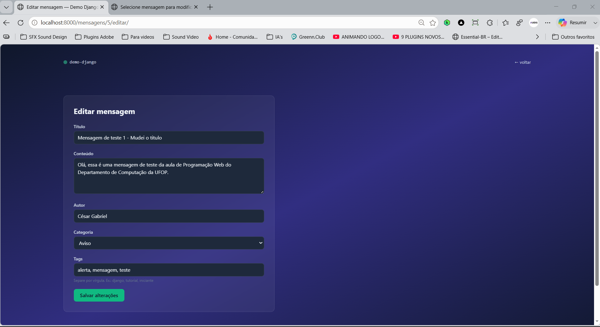
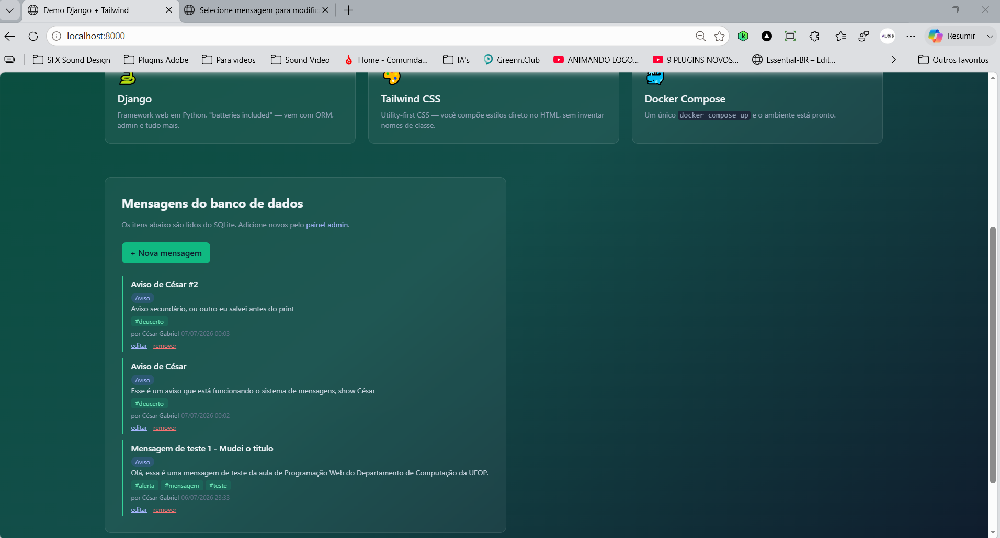
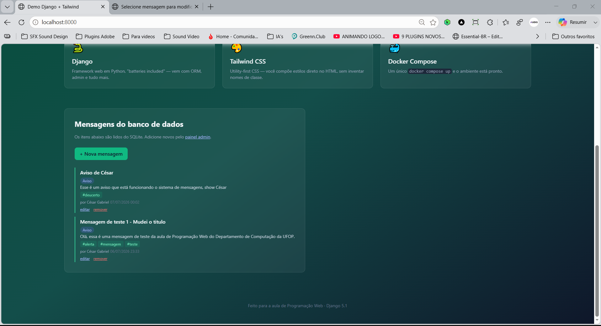

# Demo Django + Tailwind

Projeto desenvolvido para a disciplina de Programação Web, utilizando Django, Docker, SQLite e Tailwind CSS.

## Sobre esta etapa (parte 6)

Finalização do ciclo CRUD com **U**pdate e **D**elete:

* Parâmetro `<int:id>` na URL para identificar a mensagem;
* `get_object_or_404` para busca segura (404 em vez de erro de servidor);
* View `editar_mensagem`, reaproveitando o `MensagemForm` com `instance` para atualizar;
* Extração da lógica de tags para a função `_aplicar_tags` (princípio DRY);
* View `remover_mensagem`, com página de confirmação antes de apagar (remoção só via POST);
* Links "editar" e "remover" em cada mensagem da página inicial.

## Tecnologias

* [Python 3](https://www.python.org/) + [Django 5.1](https://www.djangoproject.com/)
* [Tailwind CSS](https://tailwindcss.com/) (via CDN)
* SQLite
* Docker e Docker Compose

## Como executar

```bash
docker compose up --build
```

Acesse [http://localhost:8000](http://localhost:8000) e use os links "editar"/"remover" de cada mensagem.

## Estrutura

```
demo-django/
├── core/
├── home/
├── templates/home/
├── Dockerfile
├── docker-compose.yml
├── manage.py
└── requirements.txt
```

## Screenshots

Página inicial com os links "editar" e "remover":


Formulário de edição, já preenchido com os dados atuais:



Editando o título da mensagem:



Página inicial refletindo a edição:



Página de confirmação antes de remover:


Página inicial após a remoção (mensagem removida da lista):


