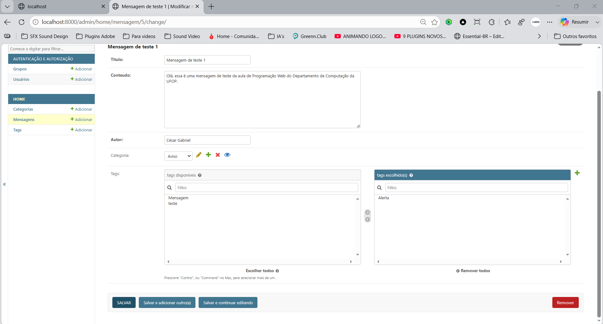

# Demo Django + Tailwind

Projeto desenvolvido para a disciplina de Programação Web, utilizando Django, Docker, SQLite e Tailwind CSS.

## Sobre esta etapa (parte 4)

Introdução de relacionamento muitos-para-muitos:

* Criação do model `Tag` (com `SlugField` para nomes únicos);
* Relacionamento muitos-para-muitos (N:N) entre `Mensagem` e `Tag` via `ManyToManyField`;
* Registro de `Tag` no admin, com `filter_horizontal` para facilitar a seleção múltipla;
* Filtro por tags na listagem de mensagens do admin;
* Associação de múltiplas tags às mensagens;
* Exibição das tags na página inicial como badges estilizadas com Tailwind CSS.

## Tecnologias

* [Python 3](https://www.python.org/) + [Django 5.1](https://www.djangoproject.com/)
* [Tailwind CSS](https://tailwindcss.com/) (via CDN)
* SQLite
* Docker e Docker Compose

## Como executar

```bash
docker compose up --build
```

Acesse [http://localhost:8000](http://localhost:8000) e [http://localhost:8000/admin](http://localhost:8000/admin).

## Estrutura

```
demo-django/
├── core/
├── home/
├── templates/home/
├── Dockerfile
├── docker-compose.yml
├── manage.py
└── requirements.txt
```

## Screenshots

Página inicial com categoria e tags na mensagem:


Painel administrativo — tags cadastradas:


Painel administrativo — seleção de múltiplas tags (filter_horizontal):


