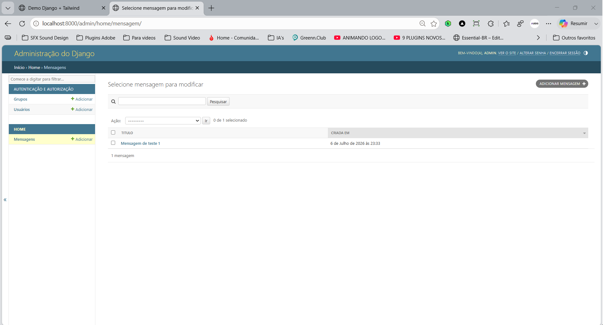

# Demo Django + Tailwind

Projeto desenvolvido para a disciplina de Programação Web, utilizando Django, Docker, SQLite e Tailwind CSS.

## Sobre esta etapa (parte 2)

Continuação do projeto, com cadastro de dados via painel administrativo:

* Criação de usuário administrador (`createsuperuser`);
* Cadastro e gerenciamento de mensagens pelo admin do Django;
* Campo `autor` adicionado ao model `Mensagem` (com migration);
* Exibição do autor na página inicial;
* Nova página `/sobre/`, com view e rota próprias;
* Navegação entre as páginas da aplicação;
* Organização seguindo o padrão MTV (Model–Template–View) do Django.

## Tecnologias

* [Python 3](https://www.python.org/) + [Django 5.1](https://www.djangoproject.com/)
* [Tailwind CSS](https://tailwindcss.com/) (via CDN)
* SQLite
* Docker e Docker Compose

## Como executar

```bash
docker compose up --build
```

Acesse [http://localhost:8000](http://localhost:8000) e [http://localhost:8000/admin](http://localhost:8000/admin) (crie um superusuário com `docker compose exec web python manage.py createsuperuser`).

## Estrutura

```
demo-django/
├── core/
├── home/
├── templates/home/
├── Dockerfile
├── docker-compose.yml
├── manage.py
└── requirements.txt
```

## Screenshots

Página inicial com mensagem cadastrada (título, conteúdo e autor):


Painel administrativo — lista de mensagens:



Painel administrativo — edição de mensagem com o campo Autor:


