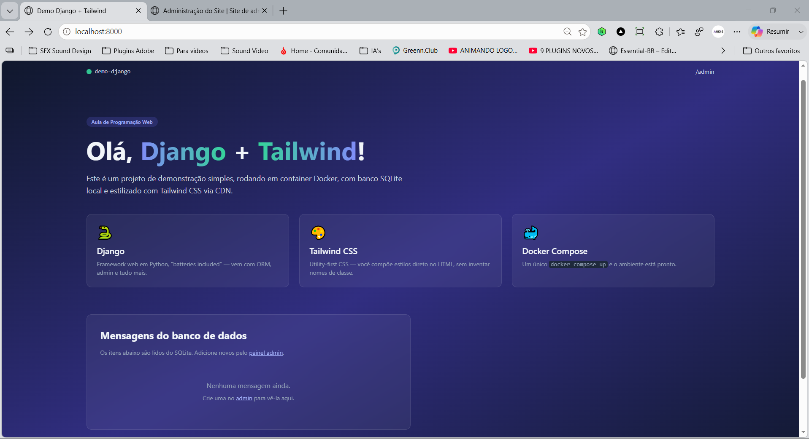

# Demo Django + Tailwind

Projeto desenvolvido para a disciplina de Programação Web, utilizando Django, Docker, SQLite e Tailwind CSS.

## Sobre esta etapa (parte 1)

Configuração inicial do projeto:

* Ambiente Docker (Dockerfile + docker-compose.yml) com Python 3.12;
* Projeto Django (`core`) e app `home`;
* Banco de dados SQLite;
* Model `Mensagem` (título, conteúdo, data de criação);
* Página inicial estilizada com Tailwind CSS via CDN, listando as mensagens do banco.

## Tecnologias

* [Python 3](https://www.python.org/) + [Django 5.1](https://www.djangoproject.com/)
* [Tailwind CSS](https://tailwindcss.com/) (via CDN)
* SQLite
* Docker e Docker Compose

## Como executar

```bash
docker compose up --build
```

Acesse [http://localhost:8000](http://localhost:8000).

## Estrutura

```
demo-django/
├── core/
├── home/
├── templates/home/
├── Dockerfile
├── docker-compose.yml
├── manage.py
└── requirements.txt
```

## Screenshots

Página inicial (sem mensagens cadastradas):


