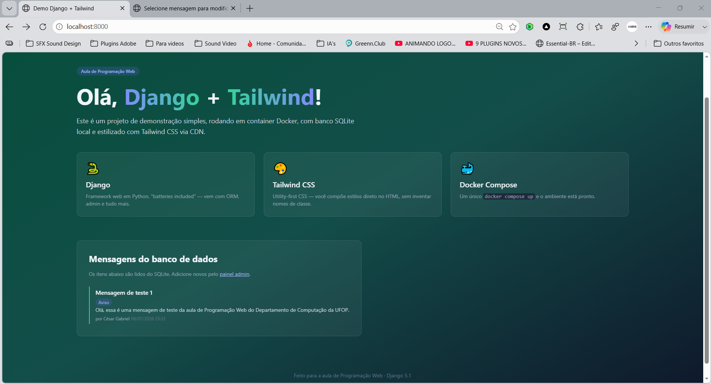
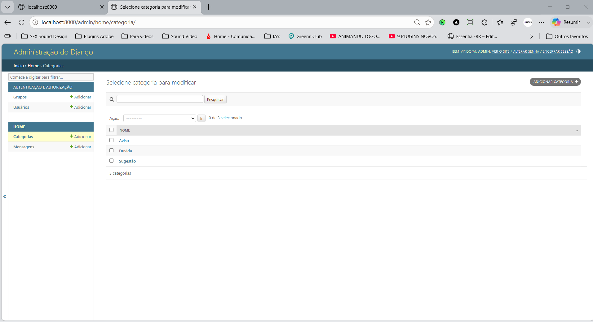

# Demo Django + Tailwind

Projeto desenvolvido para a disciplina de Programação Web, utilizando Django, Docker, SQLite e Tailwind CSS.

## Sobre esta etapa (parte 3)

Introdução de relacionamento entre models:

* Criação do model `Categoria`;
* Relacionamento um-para-muitos (1:N) entre `Categoria` e `Mensagem` via `ForeignKey`;
* Política de exclusão com `on_delete=models.SET_NULL`;
* Registro de `Categoria` no admin, com listagem, filtro e busca;
* Cadastro de categorias e associação às mensagens pelo admin;
* Exibição da categoria na página inicial como selo (badge) estilizado com Tailwind CSS.

## Tecnologias

* [Python 3](https://www.python.org/) + [Django 5.1](https://www.djangoproject.com/)
* [Tailwind CSS](https://tailwindcss.com/) (via CDN)
* SQLite
* Docker e Docker Compose

## Como executar

```bash
docker compose up --build
```

Acesse [http://localhost:8000](http://localhost:8000) e [http://localhost:8000/admin](http://localhost:8000/admin).

## Estrutura

```
demo-django/
├── core/
├── home/
├── templates/home/
├── Dockerfile
├── docker-compose.yml
├── manage.py
└── requirements.txt
```

## Screenshots

Página inicial com o selo de categoria na mensagem:



Painel administrativo — categorias cadastradas:



Painel administrativo — mensagens com coluna e filtro por categoria:


