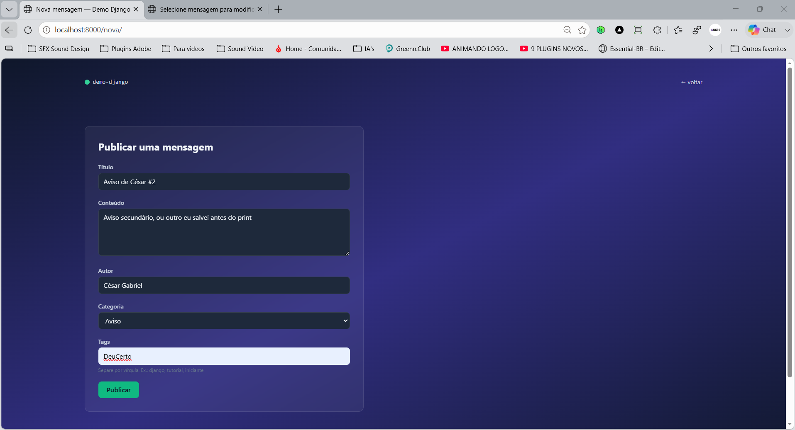

# Demo Django + Tailwind

Projeto desenvolvido para a disciplina de Programação Web, utilizando Django, Docker, SQLite e Tailwind CSS.

## Sobre esta etapa (parte 5)

Formulário público e o **C** (Create) do CRUD:

* Formulário `MensagemForm` (`ModelForm`) com campo de texto livre para tags;
* View `nova_mensagem`, tratando GET (formulário em branco) e POST (validação e gravação);
* Criação automática de tags a partir do texto digitado, via `get_or_create`;
* Proteção com `` e padrão Post/Redirect/Get;
* Botão "+ Nova mensagem" na página inicial;
* Aviso de sucesso (*flash message*) após publicar.

## Tecnologias

* [Python 3](https://www.python.org/) + [Django 5.1](https://www.djangoproject.com/)
* [Tailwind CSS](https://tailwindcss.com/) (via CDN)
* SQLite
* Docker e Docker Compose

## Como executar

```bash
docker compose up --build
```

Acesse [http://localhost:8000](http://localhost:8000) e clique em "+ Nova mensagem".

## Estrutura

```
demo-django/
├── core/
├── home/
├── templates/home/
├── Dockerfile
├── docker-compose.yml
├── manage.py
└── requirements.txt
```

## Screenshots

Página inicial com o botão "+ Nova mensagem":


Formulário público de publicação preenchido:



Página inicial após publicar, com a nova mensagem na lista:


