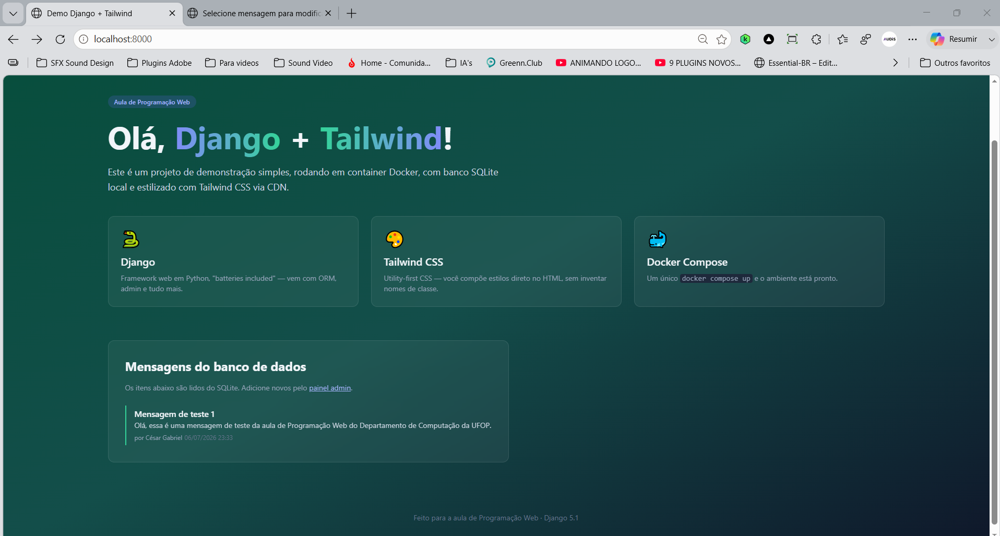
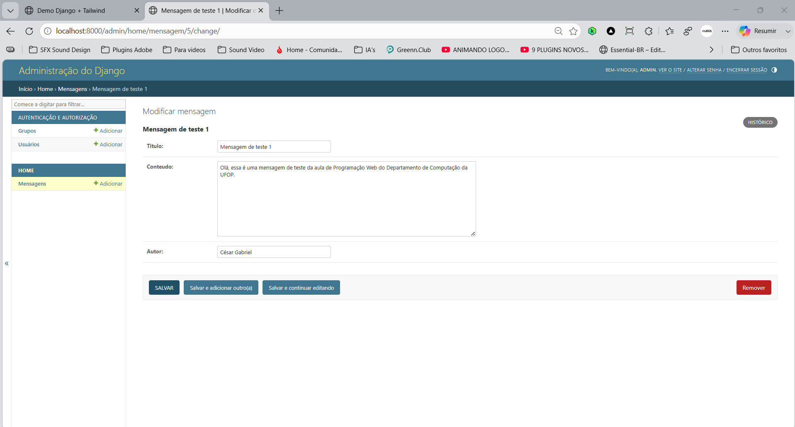
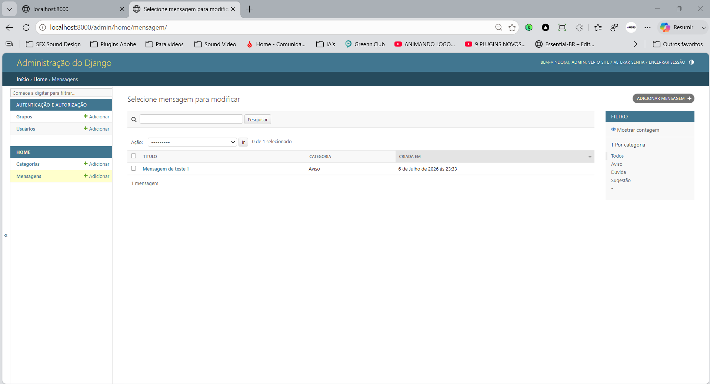
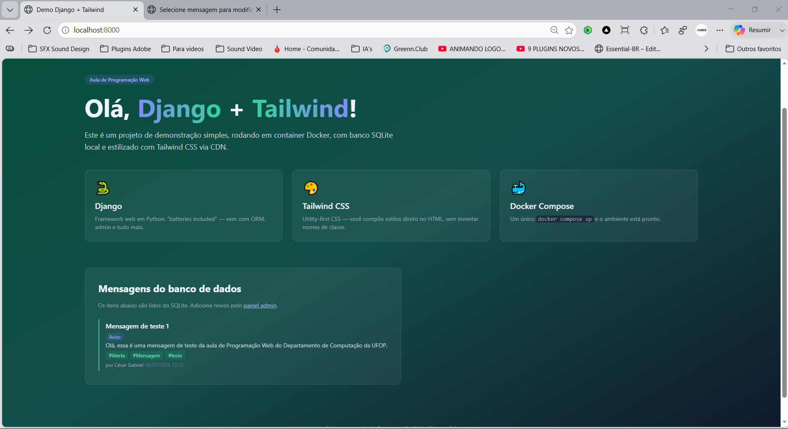
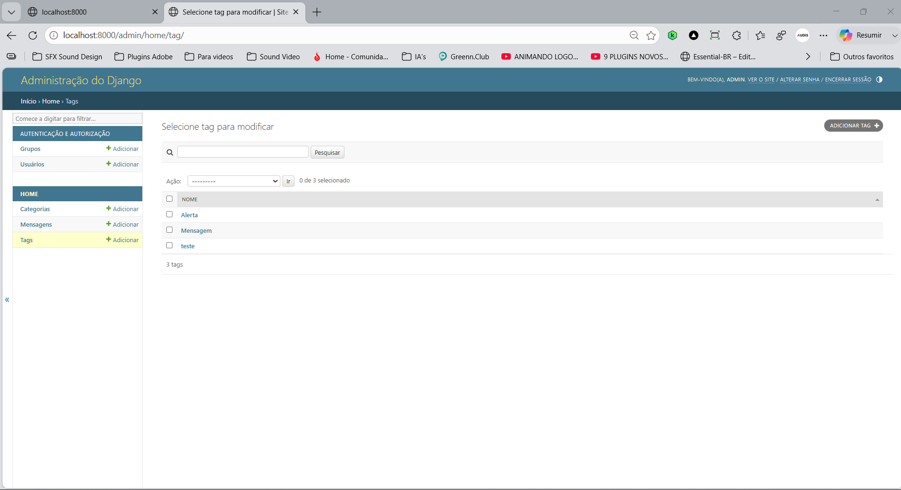
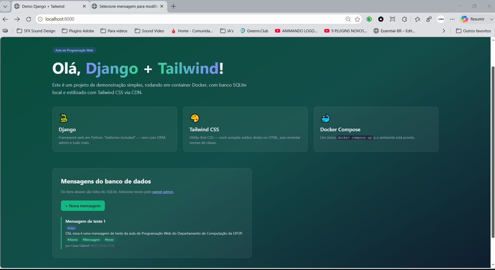
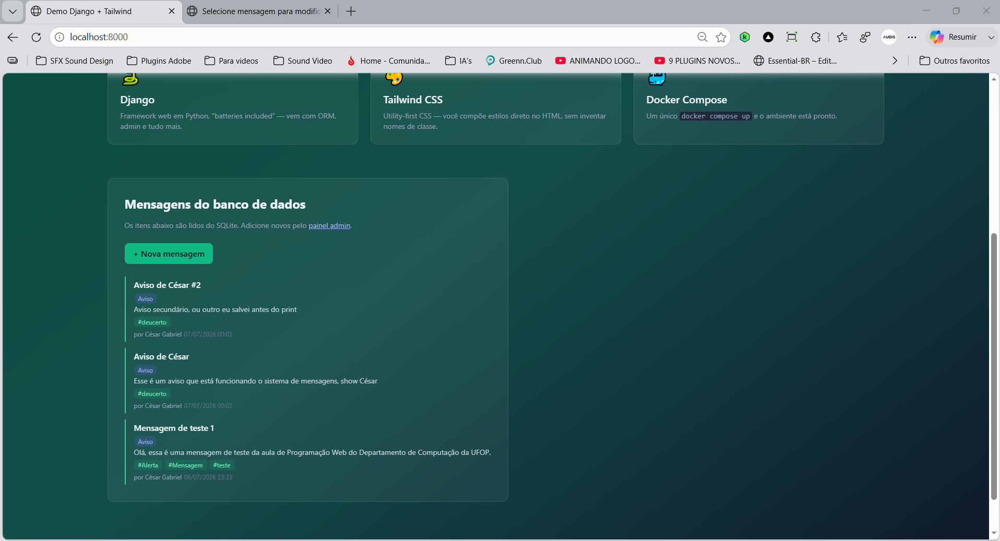
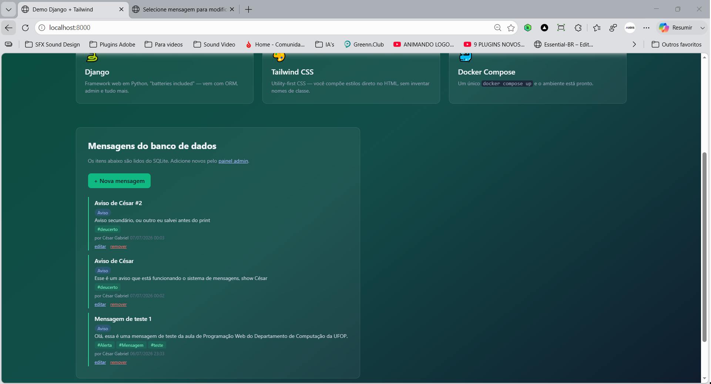
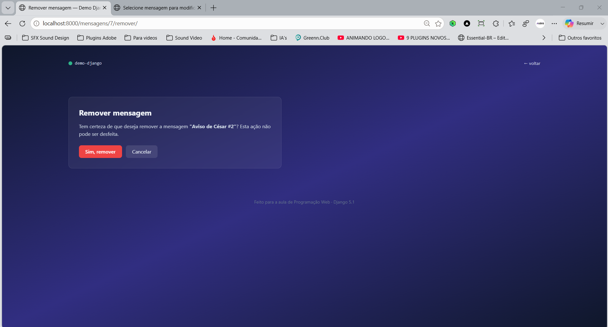

# Demo Django

Este repositório contém o projeto desenvolvido para a disciplina de Programação Web, utilizando Django, Docker, SQLite e Tailwind CSS.

A branch `main` é utilizada apenas para informações gerais sobre o repositório. O código-fonte está organizado por etapas de desenvolvimento, conforme os roteiros da disciplina.

## Branches do projeto

### `bcc481-django-parte1`

Contém a implementação do primeiro roteiro do projeto, incluindo:

* Configuração inicial do ambiente com Docker;
* Criação do projeto Django;
* Configuração do banco de dados SQLite;
* Estrutura inicial da aplicação;
* Página inicial utilizando Tailwind CSS via CDN.

**Captura de tela**

Página inicial


### `bcc481-django-parte2`

Contém a continuação do projeto, implementando todas as atividades propostas no segundo roteiro:

* Cadastro e gerenciamento de mensagens pelo painel administrativo do Django;
* Criação de usuário administrador (`createsuperuser`);
* Exibição das mensagens cadastradas na página inicial;
* Inclusão do campo autor no modelo `Mensagem`;
* Geração e aplicação de migrations;
* Criação da página Sobre (`/sobre/`);
* Configuração de novas rotas e views;
* Navegação entre as páginas da aplicação;
* Personalização do layout utilizando Tailwind CSS;
* Organização da aplicação seguindo o padrão MTV (Model–Template–View) do Django.

**Capturas de tela**

Página inicial com mensagens



Painel administrativo


Mensagem com campo autor



### `bcc481-django-parte3`

Contém a implementação do terceiro roteiro, adicionando relacionamento entre modelos e expandindo as funcionalidades da aplicação.

Nesta etapa foram implementados:

* Criação do modelo Categoria;
* Relacionamento um-para-muitos (1:N) entre `Categoria` e `Mensagem` utilizando `ForeignKey`;
* Configuração da política de exclusão com `on_delete=models.SET_NULL`;
* Registro do modelo `Categoria` no painel administrativo do Django;
* Inclusão da categoria na listagem do painel administrativo;
* Adição de filtros e pesquisa por categoria no Admin;
* Geração e aplicação das novas migrations;
* Cadastro de categorias pelo painel administrativo;
* Associação de mensagens às respectivas categorias;
* Exibição da categoria na página inicial utilizando um selo (badge) estilizado com Tailwind CSS;
* Continuidade da organização do projeto seguindo o padrão MTV (Model–Template–View) do Django.

**Capturas de tela**

Página do admin com Mensagem e Categorias



Categorias cadastradas


Página inicial com mensagens e categorias


### `bcc481-django-parte4`

Contém a implementação do quarto roteiro, introduzindo o relacionamento muitos-para-muitos (N:N) entre modelos e ampliando a estrutura do banco de dados da aplicação.

Nesta etapa foram implementados:

* Criação do modelo Tag;
* Relacionamento muitos-para-muitos (N:N) entre `Mensagem` e `Tag` utilizando `ManyToManyField`;
* Configuração do modelo `Tag` utilizando `SlugField` para armazenamento de identificadores únicos;
* Registro do modelo `Tag` no painel administrativo do Django;
* Configuração do `filter_horizontal` para facilitar a seleção de múltiplas tags no Admin;
* Inclusão de filtros por tags no painel administrativo;
* Geração e aplicação das novas migrations;
* Associação de múltiplas tags às mensagens;
* Exibição das tags na página inicial utilizando badges estilizadas com Tailwind CSS;
* Continuidade da organização do projeto seguindo o padrão MTV (Model–Template–View) do Django.

**Capturas de tela**

Página inicial com categorias e tags



Cadastro de tags no painel administrativo



Associação de múltiplas tags às mensagens


### `bcc481-django-parte5`

Contém a implementação do quinto roteiro, trazendo o formulário público de cadastro e o **C** (Create) do ciclo CRUD para a página, sem depender do painel admin.

Nesta etapa foram implementados:

* Formulário `MensagemForm` (`ModelForm`), com campo de texto livre para tags;
* View `nova_mensagem`, tratando os métodos GET e POST;
* Criação automática de tags a partir do texto digitado, via `get_or_create`;
* Proteção do formulário com `` e padrão Post/Redirect/Get;
* Botão "+ Nova mensagem" na página inicial;
* Aviso de sucesso (*flash message*) após a publicação.

**Capturas de tela**

Página inicial com o botão de nova mensagem



Formulário público de publicação


Página inicial após publicar



### `bcc481-django-parte6`

Contém a implementação do sexto roteiro, completando o ciclo CRUD com as operações de **U**pdate e **D**elete direto pela página pública.

Nesta etapa foram implementados:

* Parâmetro `<int:id>` na URL para identificar a mensagem;
* `get_object_or_404` para busca segura (404 em vez de erro de servidor);
* View `editar_mensagem`, reaproveitando o `MensagemForm` com `instance` para atualizar;
* Extração da lógica de tags para a função `_aplicar_tags` (princípio DRY);
* View `remover_mensagem`, com página de confirmação antes de apagar (remoção só via POST);
* Links "editar" e "remover" em cada mensagem da página inicial.

**Capturas de tela**

Página inicial com os links de editar e remover



Formulário de edição preenchido


Página de confirmação antes de remover



## Como acessar cada etapa

Clone o repositório:

```
git clone git@github.com:Ces4rGabriel/roteiro-django.git
cd demo-django
```

Para acessar a primeira parte:

```
git checkout bcc481-django-parte1
```

Para acessar a segunda parte:

```
git checkout bcc481-django-parte2
```

Para acessar a terceira parte:

```
git checkout bcc481-django-parte3
```

Para acessar a quarta parte:

```
git checkout bcc481-django-parte4
```

Para acessar a quinta parte:

```
git checkout bcc481-django-parte5
```

Para acessar a sexta parte:

```
git checkout bcc481-django-parte6
```

Cada branch representa um marco do desenvolvimento do projeto e corresponde ao respectivo roteiro da disciplina.
